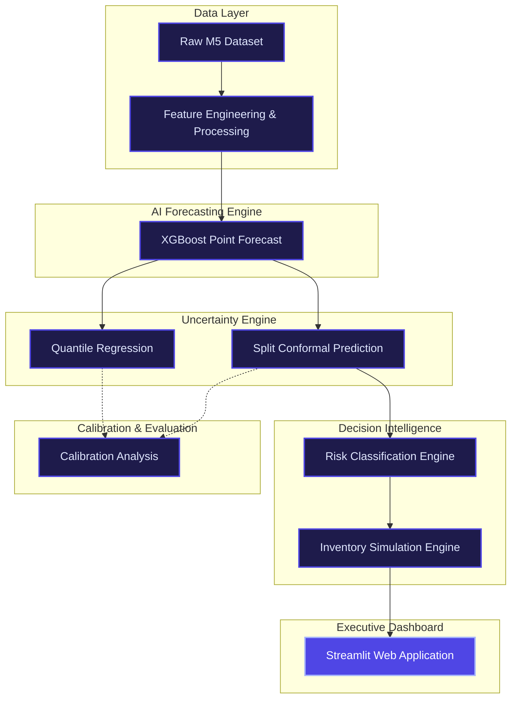

# Supply Chain Decision Intelligence Platform

> **Final Submission for Indo-Swiss Hackathon**

An enterprise-ready AI decision-support system that goes beyond traditional point forecasting. This platform predicts product demand, quantifies uncertainty with statistically calibrated confidence intervals, evaluates risk levels, and provides actionable inventory recommendations driven by business impact simulations.

---

## 🏗️ Project Architecture Diagram



---

## 📦 Installation Guide

### Prerequisites
- **Python 3.9+**
- macOS / Linux / Windows

### Setup Instructions
1. **Clone the repository** (if not already local)
2. **Navigate to the project root:**
   ```bash
   cd MLProj
   ```
3. **Install all required dependencies:**
   ```bash
   pip3 install -r requirements.txt
   ```
   *Note: This will install Streamlit, Plotly, XGBoost, Pandas, and other required packages.*

---

## 🚀 Deployment Instructions

The entire system is consolidated into a single, interactive Streamlit application. No complex backend or database setup is required.

To launch the platform locally:
```bash
streamlit run app.py
```
*The application will automatically open in your default web browser at **http://localhost:8501**.*

---

## ▶️ Demo Guide (For Judges)

This application includes an automated, guided demonstration designed specifically for hackathon presentations.

**How to run the demo:**
1. Launch the application using the deployment instructions above.
2. In the left sidebar navigation, click on **▶️ Demo Mode**.
3. Click the prominent **▶ Run Demo** button on the page.
4. The system will automatically narrate the entire 7-stage ML pipeline — from historical data ingestion to business impact — in under 3 minutes, rendering real-time UI components at each step.

---

## 📖 User Guide

The dashboard is composed of 10 modular pages, each designed to answer a specific business question. Use the sidebar to navigate between them.

| Page | Purpose & Features |
|---|---|
| **🏢 1. Executive Overview** | High-level business summary. Displays top-line KPIs (Total Cost Reduction, Service Level, ROI) alongside risk distribution charts and a geographic store heatmap. |
| **📈 2. Demand Forecasting** | Technical view of the XGBoost model. Interactively filter by store and product to visualize historical demand against point forecasts. Includes global feature importance. |
| **🎯 3. Uncertainty Analysis** | Compare Quantile Regression vs. Conformal Prediction. Features an interactive **Confidence Slider** (50% to 95%) that dynamically resizes prediction intervals. |
| **📐 4. Calibration Analysis** | Statistical validation. Displays reliability diagrams and interval coverage across different volatility segments to prove the uncertainty estimates are trustworthy. |
| **⚠️ 5. Risk Intelligence** | Actionable triage. Sortable table of all products by Risk Score, Savings Potential, or Forecast Error. Highlights the top highest-risk items requiring attention. |
| **💰 6. Business Impact** | Financial proof. Compares the "Baseline" (ordering exact forecast) vs the "Intelligent System" (risk-aware buffering). Shows simulated reductions in stockouts and holding costs. |
| **🔬 7. Scenario Simulator** | Interactive sandbox. Adjust holding cost rates, stockout penalties, and confidence targets to immediately see how recommendations and net savings change. |
| **🔍 8. Product Drill-Down** | Search engine for specific SKUs. Enter a product ID to pull up its complete forecast, uncertainty bounds, risk level, and final inventory recommendation on one screen. |
| **💬 9. Explainability** | Plain-English translation of AI outputs. Explains *why* a product received a specific risk score and *what* exact operational action the planner should take, avoiding technical jargon. |
| **▶️ 10. Demo Mode** | The automated presentation tool (see Demo Guide above). |

---

## 📁 Repository Structure

```text
MLProj/
├── app.py                    # Main Streamlit Application Entry Point
├── requirements.txt          # Python Dependency List
├── README.md                 # Project Documentation (This File)
│
├── dashboard/                # UI Presentation Layer (Stage 8)
│   ├── data_loader.py        # Centralized cached data loading
│   ├── components/
│   │   └── ui.py             # Reusable UI primitives (KPI cards, styling)
│   └── pages/                # Streamlit individual page modules
│       ├── p1_executive_overview.py
│       ├── p2_demand_forecasting.py
│       ├── p3_uncertainty_analysis.py
│       ├── p4_calibration_dashboard.py
│       ├── p5_risk_intelligence.py
│       ├── p6_business_impact.py
│       ├── p7_scenario_simulator.py
│       ├── p8_product_drilldown.py
│       ├── p9_explainability.py
│       └── p10_demo_mode.py
│
├── src/                      # Core Machine Learning Pipeline
│   ├── data/                 # Stage 1-2: Loading, EDA, Preprocessing
│   ├── models/               # Stage 3: XGBoost Forecasting
│   ├── uncertainty/          # Stage 4: Quantile & Conformal Prediction
│   ├── evaluation/           # Stage 5: Calibration & Scoring
│   └── decision/             # Stage 6-7: Risk Triage & Financial Simulation
│
└── outputs/                  # Artifacts & Persisted Data
    ├── simulation/           # Parquet files for dashboard consumption
    └── reports/              # JSON KPI metrics & summaries
```

---

## ✨ Application Quality & Engineering Practices
- **Performance:** 100% of data loading is cached via `@st.cache_data` preventing redundant I/O.
- **Modularity:** UI logic is cleanly separated into 10 individual page modules.
- **Robustness:** Handles missing data safely with graceful fallbacks.
- **Enterprise UI:** Features a custom CSS injected design system (Inter typography, responsive grid layouts, glassmorphism elements, intuitive color coding).
