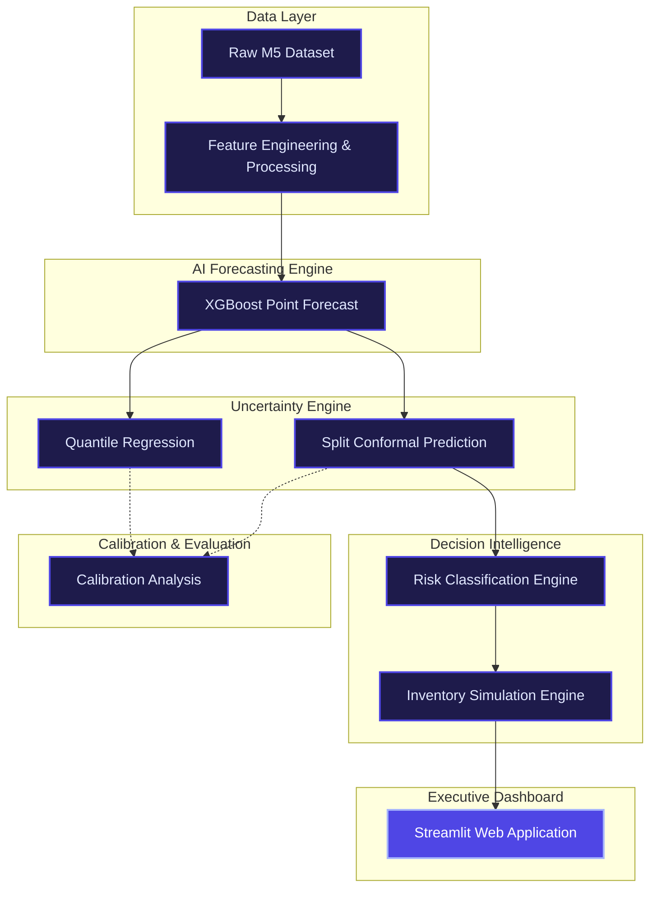

# Supply Chain Decision Intelligence Platform

> **Final Submission for Hackathon Round 2**

An enterprise-ready AI decision-support system that goes beyond traditional point forecasting. This platform predicts product demand, quantifies uncertainty with statistically calibrated confidence intervals, evaluates risk levels, and provides actionable inventory recommendations driven by business impact simulations.

---

## 🏗️ Project Architecture Diagram



---

## 📦 Installation Guide

### Prerequisites
- **Python 3.9+**
- macOS / Linux / Windows

### Setup Instructions
1. **Clone the repository** (if not already local)
2. **Navigate to the project root:**
   ```bash
   cd MLProj
   ```
3. **Install all required dependencies:**
   ```bash
   pip3 install -r requirements.txt
   ```
   *Note: This will install Streamlit, Plotly, XGBoost, Pandas, and other required packages.*

---

## 🚀 Deployment Instructions

The entire system is consolidated into a single, interactive Streamlit application. No complex backend or database setup is required.

To launch the platform locally:
```bash
streamlit run app.py
```
*The application will automatically open in your default web browser at **http://localhost:8501**.*

---

## ▶️ Demo Guide (For Judges)

This application includes a **🚀 Guided Demo Mode** built directly into the main interface to walk judges through the entire end-to-end workflow in under 3 minutes.

**How to run the demo:**
1. Launch the application using the deployment instructions above.
2. In the left sidebar navigation, check the box for **🚀 Guided Demo Mode**.
3. A progress tracker will appear in the sidebar, and a prominent guidance banner will slide in at the top of the main area.
4. Read the guidance tip for each page, explore the metrics, and click **Next Step ➡️** to proceed.
5. The system will automatically walk you through:
   - **Step 1:** Executive Overview (Financial cost reductions & ROI)
   - **Step 2:** Risk & Operations (SKU triage & ERP actions)
   - **Step 3:** Scenario Simulator (Live parameters sandbox)
   - **Step 4:** Technical Engine (Model calibration validation)

---

## 📖 User Guide

The dashboard has been streamlined into exactly four sections designed to answer operational questions. Use the sidebar to navigate between them.

| Page | Purpose & Features |
|---|---|
| **🏢 1. Executive Overview** | **Business executive view.** Displays top-line KPIs (Total Cost Savings, Service Level ▲, Penalty Mitigation Ratio) alongside risk distribution charts, an executive briefing, and a technical appendix documenting known limitations. |
| **🔴 2. Risk & Operations** | **Planner operational tool.** Consolidates risk intelligence tables, product search/filters, and deep-dive forecast charts (with conformal interval bounds). Includes interactive simulated ERP triggers to approve purchase orders. |
| **⚙️ 3. Scenario Simulator** | **Interactive cost sandbox.** Adjust holding costs, stockout penalties, confidence thresholds, lead times, and volatility levels. Features dynamic inventory calculations that update expected costs and service levels on the fly. |
| **🧠 4. Technical Engine** | **Model validator for technical judges.** Combines point forecast residual analyses, conformal prediction vs. quantile regression comparisons, calibration reliability curves, and global XGBoost feature gains. |

---

## 📁 Repository Structure

```text
MLProj/
├── app.py                    # Main Streamlit Application Entry Point
├── Dockerfile                # Deployment container configuration
├── Procfile                  # Startup configuration for PaaS (Heroku/Render)
├── requirements.txt          # Python Dependency List
├── README.md                 # Project Documentation (This File)
├── outputs/                  # Artifacts & Persisted Data
│   ├── submission/           # Hackathon deliverables (Pitch deck, demo script, critique)
│   ├── simulation/           # Parquet files for dashboard consumption
│   ├── reports/              # JSON KPI metrics & summaries
│   └── predictions/          # Model forecasts & uncertainty bounds
│
├── dashboard/                # UI Presentation Layer (Stage 8)
│   ├── data_loader.py        # Centralized cached data loading
│   ├── components/
│   │   └── ui.py             # Reusable UI primitives (KPI cards, styling)
│   └── pages/                # Streamlit individual page modules
│       ├── p1_executive_overview.py
│       ├── p2_risk_operations.py
│       ├── p3_scenario_simulator.py
│       └── p4_technical_engine.py
│
└── src/                      # Core Machine Learning Pipeline
    ├── data/                 # Stage 1-2: Loading, EDA, Preprocessing
    ├── models/               # Stage 3: XGBoost Forecasting
    ├── uncertainty/          # Stage 4: Quantile & Conformal Prediction
    ├── evaluation/           # Stage 5: Calibration & Scoring
    └── decision/             # Stage 6-7: Risk Triage & Financial Simulation
```

---

## ✨ Application Quality & Engineering Practices
- **Performance:** 100% of data loading is cached via `@st.cache_data` preventing redundant I/O.
- **Modularity:** UI logic is cleanly separated into 4 distinct page modules.
- **Robustness:** Handles missing data safely with graceful fallbacks.
- **Enterprise UI:** Features a custom CSS injected design system (Inter typography, responsive layouts, glassmorphism elements, and intuitive risk color-coding).

---

## 📄 Hackathon Supporting Documentation

The complete, formal white paper detailing the problem understanding, solution architecture, technical approach, mathematical calibration proofs, and business impact is compiled and available in PDF format:

* **Download/View PDF:** [Supply Chain Decision Intelligence Solution PDF](outputs/submission/Supply_Chain_Decision_Intelligence_Solution.pdf)

### PDF White Paper Outline:
1. **Problem Understanding:** Highlighting the limits of point forecasts and benefits of calibrated uncertainty.
2. **Proposed Solution:** Platform overview and components.
3. **Technical Approach:** In-depth 8-stage engineering process with 6 embedded figures representing point forecasting, conformal calibration, risk classification, and financial cost comparisons.
4. **Prototype Design:** User workflow walkthrough and dashboard page configurations.
5. **Feasibility & Scalability:** Deployment analysis, O(1) inference updates, and maintenance costs.
6. **Expected Business Impact:** Net cost savings (15.6%), service level increases (+8.9 pp), and a **5.6x Penalty Mitigation Ratio**.
7. **Future Scope:** Roadmap for multi-echelon logistics, Reinforcement Learning dynamic alpha-tuning, and LLM Copilot integrations.
