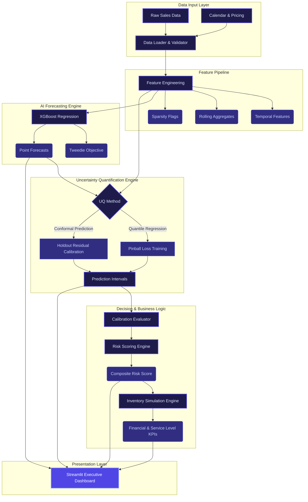
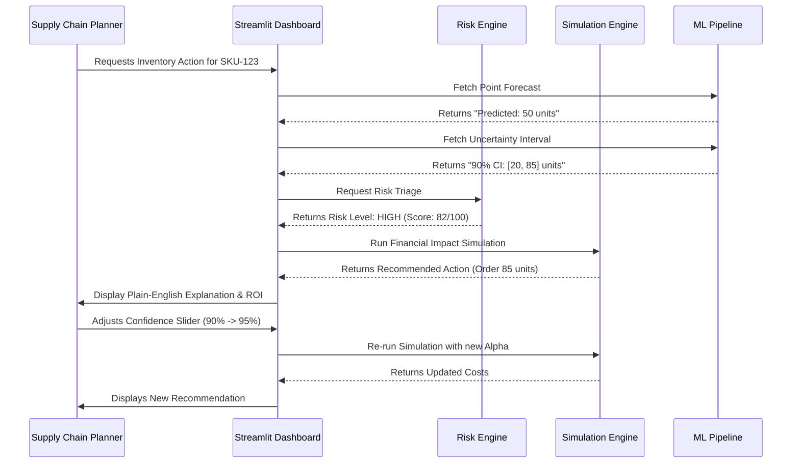
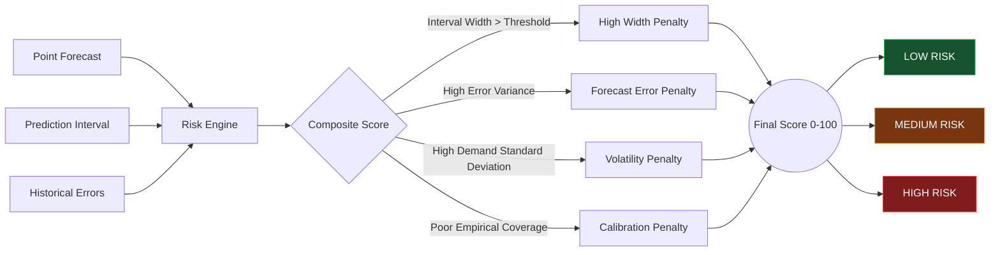
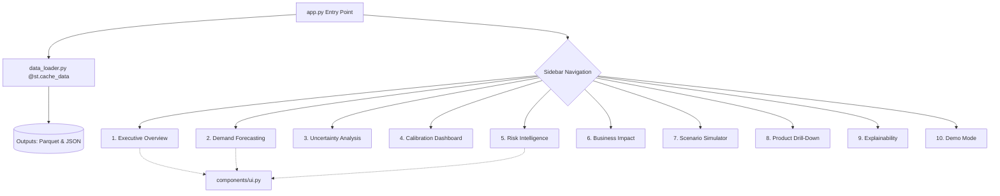

# Architecture & System Diagrams

The following professional-grade diagrams illustrate the architecture, data flow, and components of the Supply Chain Decision Intelligence Platform. They are formatted in Mermaid.js, rendering directly in GitHub, Notion, and other modern markdown viewers.

---

## 1. Overall System Architecture

---

## 2. Supply Chain Decision Flow

---

## 3. Risk Engine Scoring Mechanism

---

## 4. Dashboard Architecture & Routing

